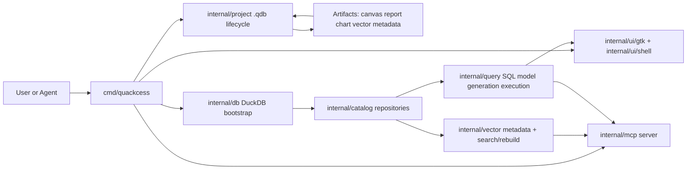
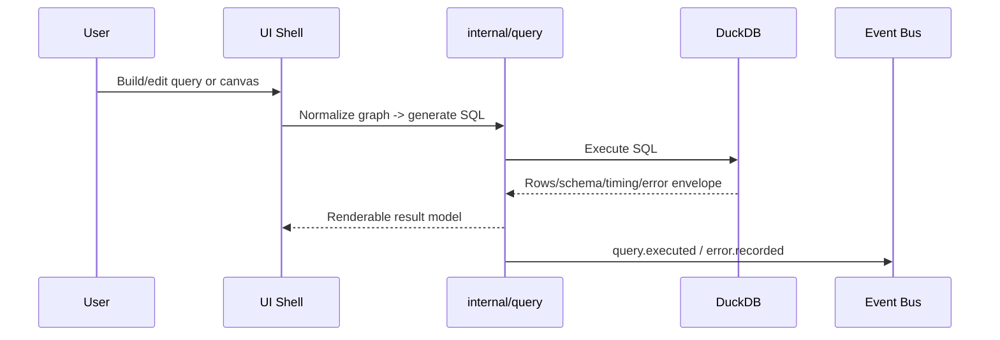
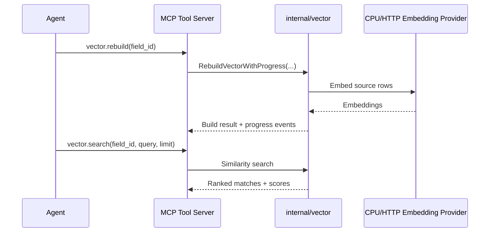

# Quackcess

Quackcess is a desktop-first, DuckDB-native project system built in Go, with a GTK3 shell and MCP control surface.

## Priority Order

Quackcess is optimized in this order:

1. Traditional data-oriented workflows (schema, SQL, relational modeling, portable project state).
2. AI memory systems using vectors (embedding fields, rebuild/search orchestration, agent-facing vector tools).
3. Analytics/reporting workflows (charts, reports, export plans).

Each of these is first-class, but the architecture and delivery order intentionally bias toward `1 -> 2 -> 3`.

## Why It Exists

Quackcess exists to modernize Access-like local workflows for a world where agents and vector memory matter:

- Keep relational work local and fast with DuckDB.
- Preserve project portability through `.qdb` package artifacts.
- Make query/canvas/report/vector artifacts addressable and automation-friendly.
- Expose a safe MCP tool plane so agent workflows are auditable and permissioned.

## System Architecture



## Runtime Flows

### Data Workflow (Priority #1)



### Vector Memory Workflow (Priority #2)



## Technical Scope (Current)

- Project lifecycle:
  - `.qdb` create/open/manifest validation.
  - artifact pack/unpack and backward-compat migration handling.
- Relational core:
  - DuckDB bootstrap/migrations with deterministic error shaping.
  - catalog CRUD for tables, columns, relationships, views, canvases, vector fields.
  - query graph normalization, SQL generation, execution envelopes, history.
- UI shell:
  - GTK3-backed shell path with headless fallback.
  - explorer + terminal command execution surface.
  - canvas command and SQL preview execution paths.
- MCP:
  - stdio transport via `modelcontextprotocol/go-sdk`.
  - authz allowlists and permission-matrix support.
  - event stream coverage for call lifecycle and denied calls.
- Vector:
  - provider config normalization (CPU and HTTP-style backends).
  - vector field listing, rebuild orchestration, semantic search contracts.
- Reports/charts:
  - chart/report spec composition and export contracts.

## MCP Tool Surface

When enabled by configuration/service wiring, core tool names include:

- `system.ping`
- `query.execute`
- `schema.inspect`
- `artifact.set`
- `artifact.get`
- `artifact.delete`
- `artifact.list`
- `chart.list`
- `report.list`
- `report.export`
- `vector.list`
- `vector.rebuild`
- `vector.search`

## Build and Run

### Requirements

- Go `1.25.x`
- Linux or macOS
- GTK3 runtime for interactive UI mode

### Build

```bash
go build -o quackcess ./cmd/quackcess
```

### Project Lifecycle Commands

```bash
# create project with embedded DuckDB
./quackcess init --name "MyProject" --db ./data/sample.duckdb ./workspace/myproject.qdb

# open interactive UI (default)
./quackcess open ./workspace/myproject.qdb

# headless mode
./quackcess open --no-ui ./workspace/myproject.qdb

# inspect manifest + vector provider status
./quackcess info ./workspace/myproject.qdb
```

### MCP Server

```bash
./quackcess mcp ./workspace/myproject.qdb
```

Permission matrix example:

```json
{
  "defaultAllow": false,
  "principals": {
    "analytics": ["*"],
    "alice": ["system.ping", "query.execute", "schema.inspect", "vector.search"]
  }
}
```

```bash
./quackcess mcp --permission-matrix ./permission-matrix.json ./workspace/myproject.qdb
```

## Vector Provider Configuration

`init` runs vector setup by default. Use `--skip-vector-setup` to defer.

Environment knobs:

- `QUACKCESS_VECTOR_BACKEND`
- `QUACKCESS_VECTOR_ENDPOINT`
- `QUACKCESS_VECTOR_PROVIDER`
- `QUACKCESS_VECTOR_MODEL`
- `QUACKCESS_VECTOR_DIMENSION`
- `QUACKCESS_VECTOR_API_KEY`
- `QUACKCESS_VECTOR_TIMEOUT_SECONDS`
- `QUACKCESS_VECTOR_CPU_SEED`

Manual setup:

```bash
./quackcess install
```

## Verification and Delivery Posture

- Contract-first development across core packages.
- CI matrix on Linux/macOS for `go test ./...` and `go build ./cmd/quackcess`.
- Release workflow on version tags creating tarballs + sha256 checksums for:
  - `linux-amd64`
  - `darwin-amd64`
  - `darwin-arm64`

## Repository Map

- `cmd/quackcess`: command parsing and runtime wiring.
- `internal/project`: manifest schema, `.qdb` pack/unpack, migrations.
- `internal/db`: DuckDB bootstrap, versioning, error normalization.
- `internal/catalog`: metadata repositories and relationships.
- `internal/query`: query graph model, SQL generation, execution/history.
- `internal/vector`: vector field model, orchestration, search/reindex services.
- `internal/mcp`: tool registry, authz, event bus, stdio bridge.
- `internal/ui/gtk`, `internal/ui/shell`, `internal/terminal`: UI shell and terminal projection loop.
- `internal/report`: chart/report model, render/export planning.

## Design References

- `docs/project-plan.md`
- `docs/internal/testing-guidelines.md`
- `docs/internal/adr-0002-visualization-and-mcp.md`
